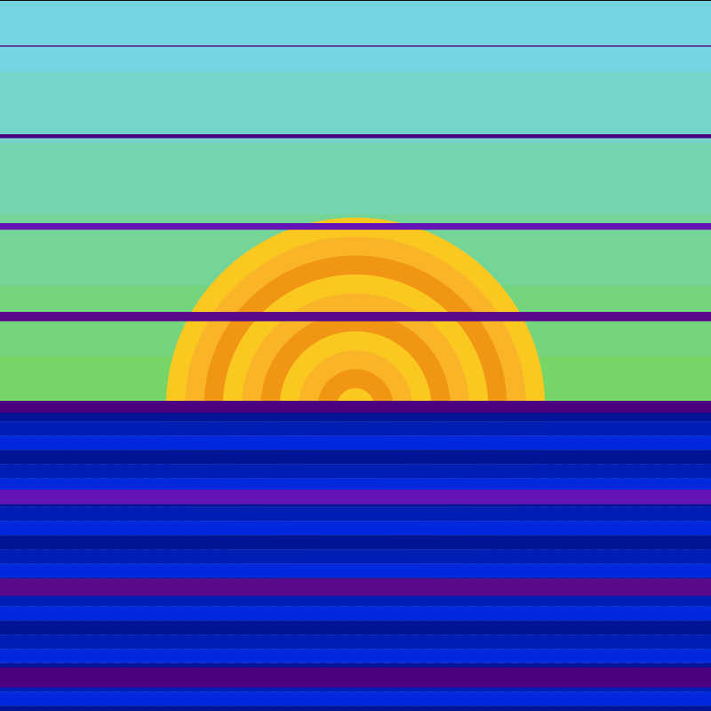

<h1 align="center">Generative Image com Haskell</h1>
<h3 align="center">Um código simples, utilizando funções do Haskell e figuras SVG para criar uma imagem.</h3>

 

## Como Utilizar o Algoritmo

 
  <a>Para mudar as configurações da imagem, tanto tamanho da mesma quanto a configração dos componentes, deve-se mudar no código, no arquivo Main.hs. Em comentários está explicado como mudar cada componente.</a>

## Resultados

 
  <a>Resultados do algoritmo:</a>

 
  
  

